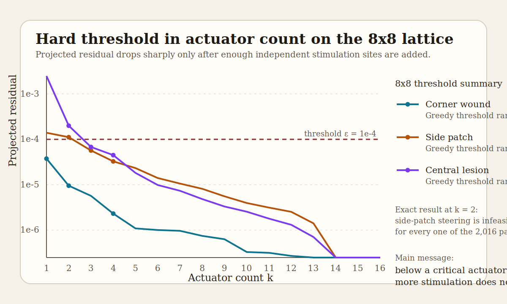

# Hard Limits on Sparse Bioelectric Control

Finite-horizon control theory for gap-junction-coupled tissue repair.

This repository studies a simple but experimentally relevant question:

> How many independently addressable stimulation sites are required before a damaged bioelectric tissue state becomes repairable?

The central result is that this is not just an energy question. In the frozen linearized control problem, there are damage geometries for which **no amount of control energy works below a critical actuator count** because part of the damage lies outside the controllable subspace.

## Why This Repo Exists

Bioelectric medicine has good tools and weak design rules. Experimentalists can perturb voltage with optogenetics, ion-channel drugs, and electrodes, but there is still no compact quantitative theory that says:

- where to stimulate
- how many sites are required
- when extra power is useless because the intervention is too low-rank

This repo builds that theory on a gap-junction network model with bistable local voltage dynamics.

## What Is Here

- `research/control_gap_junction/`
  - simulation code for the frozen damaged lattice
  - local linearization machinery
  - controllability Gramian and minimum-energy control helpers
  - actuator placement and rank-threshold studies
- `docs/derivations/`
  - controlled-dynamics setup
  - finite-horizon linear minimum-energy derivation
- `docs/results/`
  - overlap matrices
  - exhaustive two-site scans
  - greedy rank envelopes
  - disorder and scaling studies
- `docs/manuscript-draft.md`
  - current manuscript draft built from the saved artifacts

## Current Headline Results

- On `8x8`, exact two-site steering of a realistic side-patch wound is infeasible.
- Greedy actuation-rank thresholds at residual `< 1e-4` are:
  - corner wound: `2`
  - side patch: `3`
  - central lesion: `3`
- On `16x16`, the same threshold phenomenon persists under structured greedy placement, and the side patch becomes substantially harder (`6`).
- Random gap-junction dilution shifts the side-patch threshold upward from stable `3` at `0-10%` dilution to mostly `4-5` by `30%`.
- The controllable modes are Laplacian-structured but not Laplacian-pure, so topology alone does not determine optimal placement.

## Read First

- [docs/manuscript-draft.md](docs/manuscript-draft.md)
- [docs/results/final-three-computations.md](docs/results/final-three-computations.md)
- [docs/results/actuation-rank-study-8x8.md](docs/results/actuation-rank-study-8x8.md)
- [docs/results/default-lattice-phase2-baseline.md](docs/results/default-lattice-phase2-baseline.md)
- [docs/derivations/linear-minimum-energy-control.md](docs/derivations/linear-minimum-energy-control.md)

## Cite and Reuse

- Citation metadata: [CITATION.cff](CITATION.cff)
- License: [LICENSE](LICENSE)

## Status

This is an active research repository, not a polished package release.

What is solid:

- the finite-horizon linearized control formulation
- the exact `8x8` two-site infeasibility result
- the saved numerical artifacts behind the current manuscript draft

What is still open:

- sensitivity to horizon `T`
- sensitivity to residual tolerance `epsilon`
- exhaustive higher-rank searches beyond `k = 2`
- nonlinear basin-entry analysis beyond the frozen linearized problem

## Reproducibility

The project is organized as a GPD-style research repo with derivations, state tracking, and saved result artifacts. The current environment was verified by direct Python execution of the analysis and test helpers.

## Framing

If the central result survives extension to nonlinear basin entry and experimental geometry, then the practical message is simple:

**Below a critical intervention rank, more stimulation does not help.**
